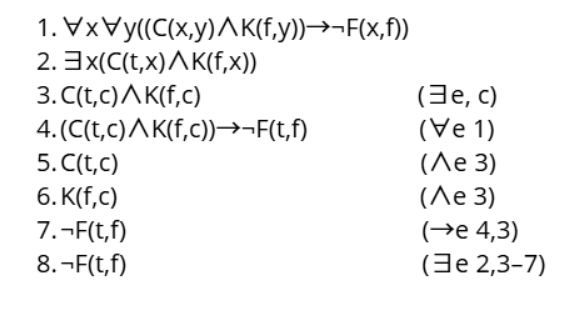

# aps-matematica-discreta-prolog

Para rodar:

Instale o interpretador do Prolog neste site:

    https://www.swi-prolog.org/download/stable

Depois de instalar (e reiniciar o VSCode), rode o comando:

    swipl

no terminal. Se tudo estiver certo, deverá aparecer:

    Welcome to SWI-Prolog (threaded, 64 bits, version 9.2.9)
    SWI-Prolog comes with ABSOLUTELY NO WARRANTY. This is free software.
    Please run ?- license. for legal details.

    For online help and background, visit https://www.swi-prolog.org
    For built-in help, use ?- help(Topic). or ?- apropos(Word).

    1 ?-

Insira no terminal [undertale]. (ficará `1 ?- [undertale].`), deve retornar `true.`.

-----------------------------------------------------------------------------------------------------------------
## APS — Lógica e Matemática Discreta
### Giovanna Barros Scalco e Gustavo Nicácio

**Objetivo**
Aplicar os conceitos de Lógica de Primeira Ordem para representar formalmente o universo do jogo Undertale, utilizando predicados, funções e quantificadores. Em seguida, demonstrar deduções naturais com base nas regras lógicas e, depois, implementar o modelo em Prolog.

**Cenário Escolhido: Undertale**
No universo de Undertale, humanos e monstros coexistem em um mundo em que as ações dos personagens determinam diferentes rotas narrativas: Pacifista, Neutra e Genocida, em que depende do número de monstros que o personagem decide enfrentar. Para esta atividade pode-se modelar logicamente as relações entre personagens.

### Modelagem Lógica
**Predicado**
H(x) - x é humano
M(x) - x é monstro
D(x) - x tem determinação
P(x) - x está trilhando a rota pacifista
N(x) - x está trilhando a rota neutra
G(x) - x está trilhando a rota genocida

**Relação**
C(x,y) - x é pai/mãe de y
K(x,y) - x matou y
S(x,y) - x poupou y
F(x,y) - x é amigo de y

**Constante**
f - Flowey
s - Sans
t - Toriel

### Fórmulas em Lógica de Primeira Ordem
∀x( H(x) ∧ ∀y( M(y) ∧ K(x, y) ) ∧ ¬∃z( M(z) ∧ S(x, z) ) → G(x) )
∀x( H(x) ∧ ∃yS(x, y) → P(x) ∨ N(x) )
∀x( H(x) ∧ ∃yK(x, y) → G(x) ∨ N(x) )
∀x( H(x) ∧ ∃yK(x, y) ∧ ∃zS(x, z) → N(x) )
∀x( D(x) → H(x) ∨ M(x) ∨ x = f )
∀x( H(x) ∧ G(x) ∧ S(x, s) → K(s, x) )
∀x( (H(x) ∧ ¬M(x)) ∨ (¬H(x) ∧ M(x)) )
∀x∀y∃z( (C(x, y) ∧ K(z, y)) → ¬F(x, z) )
∀x∀y( H(x) ∧ M(y) ∧ P(x) → F(y, x) )
∃x( M(x) ∧ ∀y( H(y) ∧ S(x, y) ) → x = t )

**Dedução Natural**
*Para o caso 7:*
∀x( (H(x) ∧ ¬M(x)) ∨ (¬H(x) ∧ M(x)) ) deve chegar em ∀xH(x) -> ∀x(¬M(x))

*Para o caso 8:*
∀x∀y∃z((C(x,y)∧K(z,y))→¬F(x,z))

### Implementação em Prolog

O programa foi estruturado em quatro partes principais:

- Constantes e fatos: definem humanos, monstros, relações familiares e ações do jogo;
- Predicados auxiliares: funções para checar condições, como monstros mortos ou poupados;
- Fórmulas previamente definidas: traduções das proposições lógicas apresentadas na APS para a sintaxe de Prolog.
- Consultas: exemplos de execução para verificar os comportamentos esperados.

A modelagem segue a lógica proposta, permitindo testar rotas definidas como genocida, neutra ou pacifista
Consultas e resultados esperados

- Frisk segue a rota neutra (matou e poupou monstros);
- Humanos e monstros mantém integridade de tipo;
- Toriel não é inimiga de Frisk e poupa todos os humanos;
- O comportamento geral está de acordo com as fórmulas lógicas definidas.

Portanto, o modelo Prolog desenvolvido cumpre o objetivo de representar logicamente as relações e ações do universo Undertale, demonstrando como a lógica de predicados pode ser aplicada para simular cenários narrativos e verificar formalmente propriedades definidas por fórmulas matemáticas.
