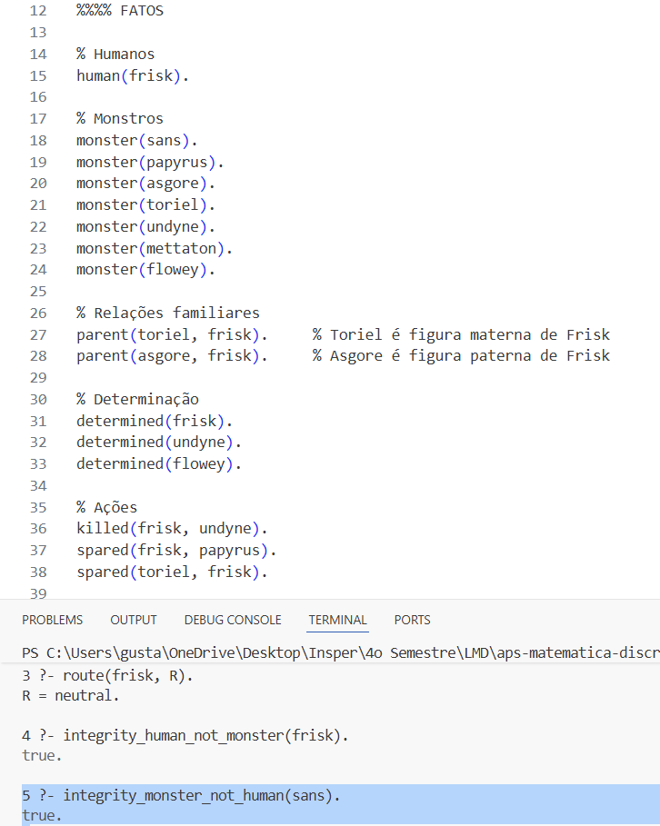

# aps-matematica-discreta-prolog

Para rodar:

Instale o interpretador do Prolog neste site:

    https://www.swi-prolog.org/download/stable

Depois de instalar (e reiniciar o VSCode), rode o comando:

    swipl

no terminal. Se tudo estiver certo, deverá aparecer:

    Welcome to SWI-Prolog (threaded, 64 bits, version 9.2.9)
    SWI-Prolog comes with ABSOLUTELY NO WARRANTY. This is free software.
    Please run ?- license. for legal details.

    For online help and background, visit https://www.swi-prolog.org
    For built-in help, use ?- help(Topic). or ?- apropos(Word).

    1 ?-

Insira no terminal [undertale]. (ficará `1 ?- [undertale].`), deve retornar `true.`.

## Prints do código funcionando com exemplos:

Na print acima, temos que o personagem Toriel poupou todos os humanos. Com isso, confirma-se que Toriel = Toriel.

==========================================================================

De acordo com os fatos, Frisk matou um monstro e poupou outro (logo, nem matou todos nem poupou todos). Ou seja, por definição, Frisk está na rota Neutra.

==========================================================================

Frisk é humano, logo não é monstro.

==========================================================================

Sans é monstro, logo não é humano.

==========================================================================

Frisk não fez nada para ter a inimizade de Toriel.

==========================================================================

Frisk não fez nada para ter a amizade de Papyrus (não ser inimigo != ser amigo).

